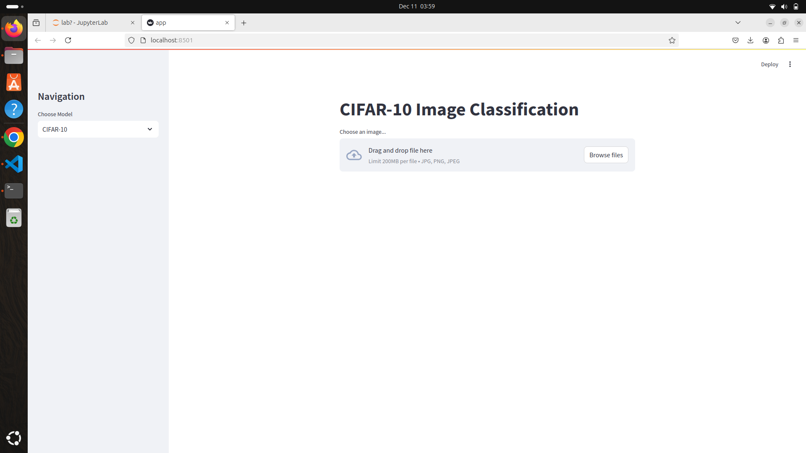
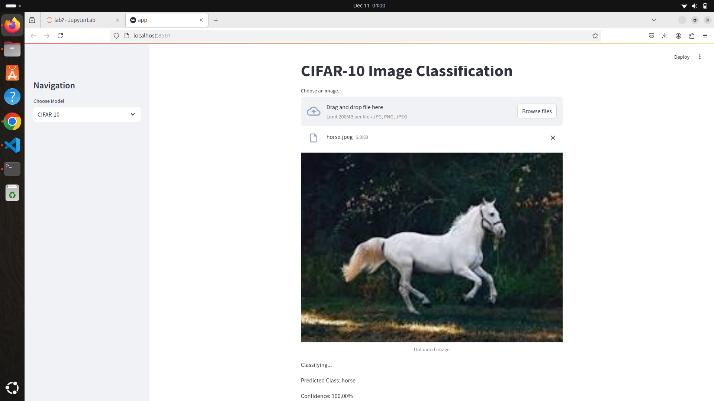
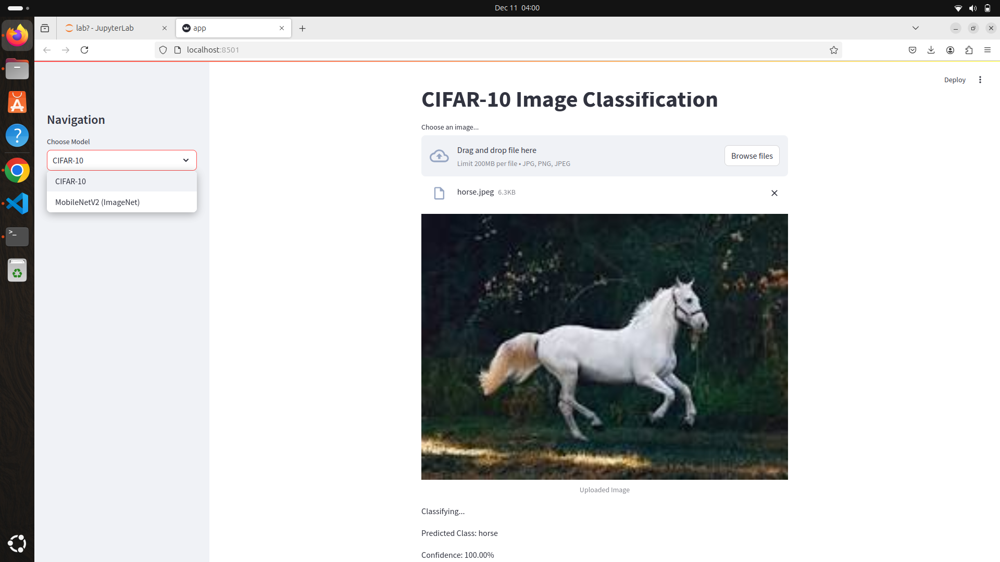

# P1-Image-Classification-by-Machine-Learning-AICTE-Edunet-Internship
 
I have done this project to classify images by using CNNmodel and Pre Trained Mobile Net model. I created the streamlit app for the same.
 
<h2>How to rum the code</h2>
 
<h3>You can now view your Streamlit app in your browser.</h3>
 
  Local URL: http://localhost:8501
   
  Network URL: http://192.168.1.12:8501
 
<h1>Overview:</h1>
 

 
 

 
 

